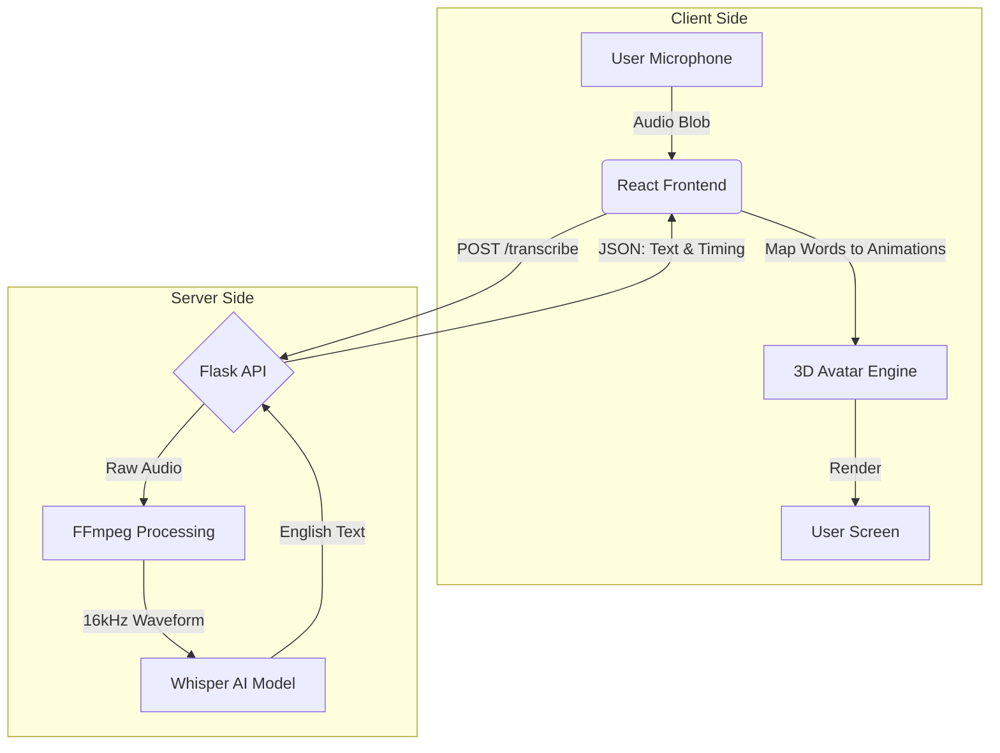

# 🌊 SignWav

### Bridging the gap between sound and silence with AI.

**SignWav** is an open-source initiative dedicated to breaking communication barriers between the hearing and the deaf communities. Our mission is to build a real-time, universal **Speech-to-Sign Language** translator using state-of-the-art Deep Learning.

---

## 🎯 Project Objectives

Our primary goal is to create a seamless interface where spoken language is instantly visualized as American Sign Language (ASL).

* **Universal Accessibility:** Enable hearing individuals to communicate with the Deaf community without knowing ASL, using their native language.
* **Real-Time Performance:** Achieve low-latency translation (Speech-to-Sign) suitable for live conversations.
* **Educational Tool:** Serve as an interactive learning platform for students wishing to learn ASL syntax and vocabulary.
* **Open Architecture:** Provide a modular backend/frontend structure that allows developers to swap AI models or animation engines easily.

---

## 🧠 The Deep Learning Pipeline (Hearing & Understanding)

The core of SignWav relies on a sophisticated audio processing chain designed to handle noise, accents, and multiple languages.

### Step 1: Audio Capture & Preprocessing
* **Input:** The frontend captures user audio via the Web Audio API.
* **Normalization:** The raw stream is sent to the backend where **FFmpeg** converts it into a standardized 16kHz mono waveform, removing background noise and silence.

### Step 2: The Neural Inference (Whisper)
We utilize **OpenAI's Whisper**, a Transformer-based architecture trained on 680,000 hours of multilingual data.
* **Feature Extraction:** The audio is converted into a Log-Mel Spectrogram.
* **Encoder-Decoder:** The Transformer processes the spectrogram.
* **Task Forcing:** We strictly implement the `task="translate"` parameter. This forces the model to ignore the source language (French, Arabic, etc.) and output the semantic meaning directly in **English Text**.

### Step 3: Text Normalization (NLP)
Before sending data to the avatar, the English output is sanitized:
* Punctuation removal.
* Lowercasing.
* Tokenization (breaking sentences into words).

---

## 🤖 The Avatar Animation System (Seeing & Moving)

Converting text to movement requires mapping linear spoken words to spatial sign language gestures.

### Step 1: English-to-Gloss Conversion
ASL has a different grammar than spoken English (Topic-Comment structure).
* *Input:* "I am going to the store."
* *Process:* The NLP engine simplifies this to ASL Gloss (Key concepts).
* *Output:* "ME GO STORE."

### Step 2: Motion Retrieval
The system queries our database of motion files (FBX/GLB animations).
* Each Gloss word is linked to a specific 3D animation clip.
* If a word is missing from the dictionary, the system falls back to **Fingerspelling** (spelling the word letter by letter).

### Step 3: Real-Time Rendering & Blending
* **Engine:** The Frontend (Three.js/Unity) receives the list of animations.
* **Interpolation:** To ensure the robot doesn't look "jerky," the engine blends the end of one sign into the start of the next (Cross-fading), creating fluid, human-like motion.

---

## 🚀 Architecture Diagram

## 🛠️ Technology Stack

* **Backend:** Python, Flask, PyTorch, OpenAI Whisper, FFmpeg.
* **Frontend:** React.js, TailwindCSS.
* **3D & Animation:** Three.js / React-Three-Fiber, Mixamo (Animations).
* **Deployment:** Docker (planned).

## 🗺️ Roadmap

- [x] **Phase 1: The Hearing System**
    - Implementation of the Whisper model.
    - Setup of the Flask API.
    - Validation of the "Universal to English" translation pipeline.

- [ ] **Phase 2: The Visual Bridge**
    - Development of the Web Interface.
    - Client-Server audio transmission protocols.

- [ ] **Phase 3: The Signing Avatar**
    - Mapping English phonemes/words to ASL gestures.
    - Integration of a 3D Character.
    - Real-time synchronization and blending.

---

### *Powered by Code, Driven by Inclusion.*
*Maintained by Taki eddine El Attari & Oussama Chichaoui.*
